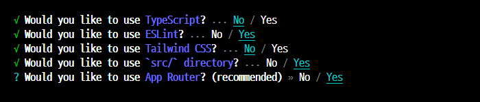

# NextJS framework 를 이용한 back-end + front-end + DB 를 연동한 프로젝트

- (nextJS 공식 사이트) : [https://nextjs.org]
- [nextJS 공식 사이트](https://nextjs.org)

```html
<a href="https://nextjs.org">nextJS 공식사이트</a>
```

## NextJS 프로젝트 생성하기

- 프로젝트 생성하기

```bash
npx create-next-app@latest myproject
```

- 프로젝트 생성 옵션 선택하기



- 프로젝트 실행 : 개발환경에서 실행하기

```bash
cd myproject
npm install
npm run dev
```

- 프로젝트 빌드와 실행 : 운영환경에서 실행하기

```bash
npm run build
npm run start
```

## 소스코드에서 `Parsing error...` 오류 발생할 경우

- 프로젝트의 `.eslintrc.json` 파일 내용을 다음과 같이 수정하고, work 폴더에 해당 파일 복사하여 붙여넣기

```json
{
  "extends": ["next/babel", "next/core-web-vitals"]
}
```

- 그래도 오류가 계속되는 경우 work 폴더에 `.babelrc` 파일을 만들고 다음 코드를 복사 붙여 넣기

```json
{
  "presets": ["next/babel"],
  "plugins": []
}
```

## NextJS 의 프로젝트 폴더와 파일 구조

- `src/app` : 프로젝트 시작점 폴더 `localhost:3000/` 의 요청을 처리하는 곳
- `src/app/user` : `localhost:3000/user` 의 요청을 처리하는 곳
- `src/app/user/layout.js` : `localhost:3000/user/*` 의 요청에 대하여 layout 을 설정하는 파일
- `src/app/user/login/page.js` : `localhost:3000/user/login` 의 요청에 대하여 rendering 하는 파일
- `public/` : 프로젝트의 static(image, 동영상)파일들을 저장하는 곳
